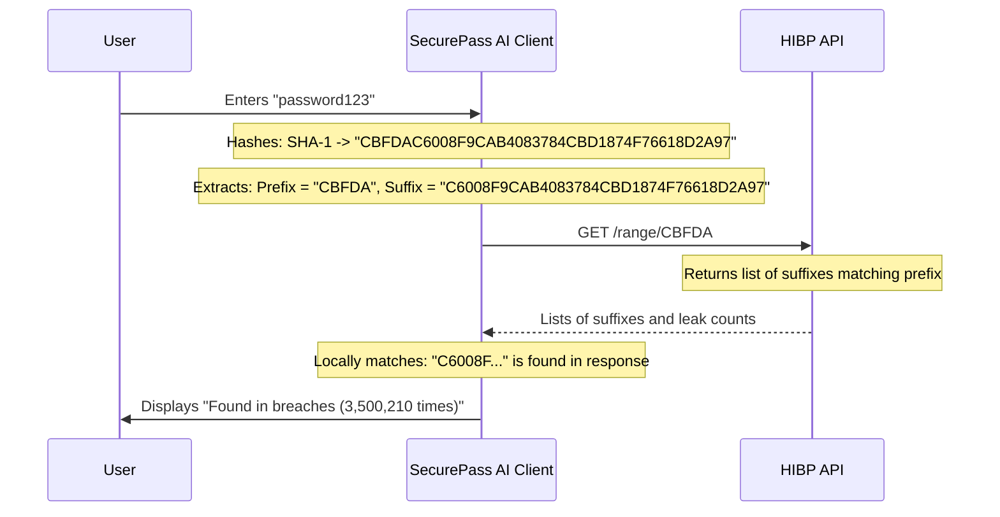

# SecurePass AI 🛡️

**SecurePass AI** is a premium, modern, cybersecurity-focused web application designed to audit credentials in real-time. It combines static mathematical audits (entropy, length, character groupings), network leak testing, interactive attack simulations, a secure GCM-encrypted credential vault, and gamified security challenges.

Built using a **Spring Boot** REST backend, a **PostgreSQL** database, and a responsive **React (TypeScript + Tailwind CSS + Framer Motion)** interface.

---

## Key Core Features

1. **Real-time Password Analyzer**: Calculates entropy, complexity breakdown, strength score (0-100), and provides actionable improvement suggestions.
2. **AI Upgrade Assistant**: Proposes memorable leetspeak and symbol substitutions to elevate weak passwords to strong grades.
3. **Attack Simulator**: Visualizes cracking speeds against Brute Force, Dictionary, Hybrid, and Credential Stuffing attacks.
4. **Zero-Trust Breach Checker**: HIBP range checking hashes passwords locally, sending only the first 5 characters of the SHA-1 hash to preserve privacy (k-Anonymity model).
5. **Secure Vault**: Encrypts generated passwords using military-grade **AES-256 GCM** encryption, decrypting them in-memory only for the owner.
6. **Gamified Security Academy**: Learn about passphrases, MFA threats, and phish-defense. Complete daily challenges and pass security quizzes to earn achievement badges.
7. **Sandbox Sandbox (Demo Mode)**: Switch seamlessly between mock client storage and live REST configurations using the connection toggle in the navbar.

---

## Technology Stack

### Backend
- **Framework**: Spring Boot 3.2.4 (Java 17)
- **Security**: Spring Security & Stateless JWT Authentication
- **Persistence**: Spring Data JPA & PostgreSQL Driver
- **Validation**: Jakarta Validation & Global Exception Handling
- **API Documentation**: Springdoc OpenAPI (Swagger UI)

### Frontend
- **Framework**: React 18 (Vite + TypeScript)
- **Styling**: Tailwind CSS (custom dark grids, glassmorphism, responsive grids)
- **Animations**: Framer Motion
- **Icons**: Lucide Icons
- **Strength Library**: zxcvbn password strength engine

### DevOps & CI/CD
- **Containerization**: Docker & Docker Compose
- **Pipeline**: GitHub Actions (lint & compilation testing)

---

## Directory Layout

```text
Password analyser/
├── backend/                   # Spring Boot 3.x Java project
│   ├── src/main/java/...      # Config, Controllers, Repositories, Services, Entities, DTOs
│   ├── src/main/resources/    # Application properties (YAML)
│   └── pom.xml                # Maven Dependencies
├── frontend/                  # React 18 TypeScript Vite project
│   ├── src/                   # Pages, Components, Contexts, Services, Styling
│   ├── package.json           # Client Dependencies
│   └── tailwind.config.js     # Tailwind Configurations
├── docker-compose.yml         # Dev Environment (PostgreSQL + pgAdmin)
└── README.md                  # Documentation
```

---

## Setup & Running Locally

### 1. Prerequisite Environments
Make sure you have installed:
- [Docker & Compose](https://www.docker.com/)
- [Java 17 JDK](https://adoptium.net/)
- [Node.js 18+](https://nodejs.org/)
- [Maven](https://maven.apache.org/)

---

### 2. Spinning Up the Database
In the root directory, start the PostgreSQL database and pgAdmin using Docker:
```bash
docker-compose up -d
```
- PostgreSQL is available at `localhost:5432` (db: `securepass_db`, user: `postgres`, password: `password`).
- pgAdmin is available at `http://localhost:5050` (credentials: `admin@securepass.ai` / `admin`).

---

### 3. Launching the Spring Boot Backend
Navigate into the `backend` directory, install packages, and boot the server:
```bash
cd backend
mvn spring-boot:run
```
- The REST API spins up on port `8080`.
- Swagger documentation is available at `http://localhost:8080/swagger-ui/index.html`.

---

### 4. Launching the React Frontend
Navigate into the `frontend` directory, install packages, and start the development server:
```bash
cd ../frontend
npm install
npm run dev
```
- The frontend client starts on `http://localhost:5173`.
- **Toggle connection mode**: In the navbar, toggle between **Sandbox Mode** (running instantly on mock local storage) and **Live Server** (making real API calls to Spring Boot).

---

## Security Specifications

### AES-256 GCM Encryption
Saved passwords in the database are encrypted using AES in Galois/Counter Mode (GCM). GCM provides both confidentiality and integrity authentication.
Each record uses a unique, cryptographically random 96-bit Initialization Vector (IV). The IV is combined with the ciphertext and stored in the database:
`Base64(IV + Ciphertext + AuthTag)`.

### HIBP k-Anonymity Model

At no point is your raw password or its full hash sent over the internet. Only the first 5 characters of the SHA-1 hash are queried.
